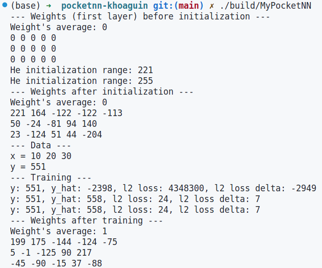
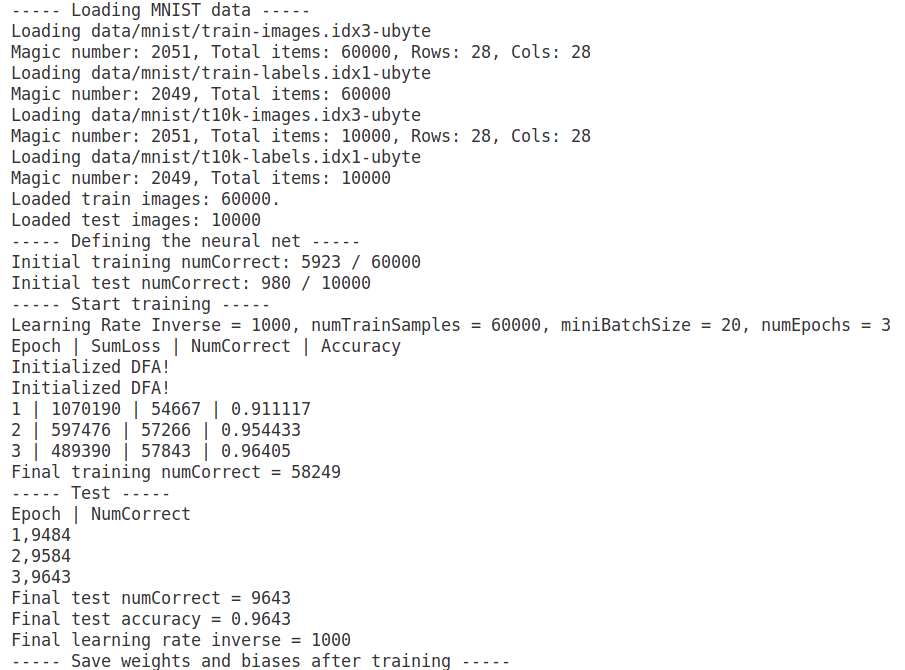
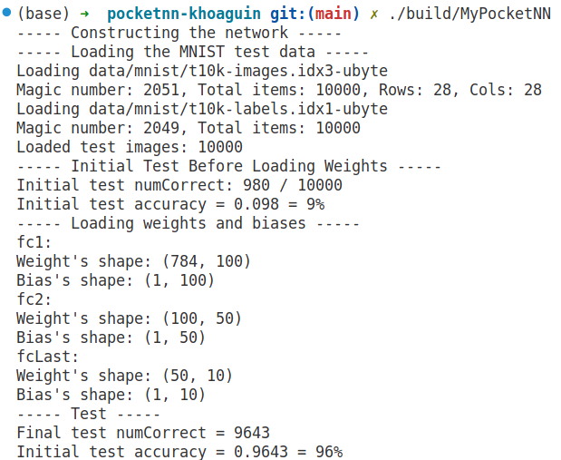

# PocketNN
The Linux implementation of [PocketNN: Integer-only Training and Inference of Neural Networks via Direct Feedback Alignment and Pocket Activations.](https://github.com/jaewoosong/pocketnn)

Improvements:
- The original [code](https://github.com/jaewoosong/pocketnn) was implemented in Windows environment, hence will produce some problems when executing in the linux environment.
- Add functions to save and load weights of neural network into `.csv` files after training so we can load them to do inference later. The inference process only on the MNIST dataset is done in the `fc_int_dfa_mnist_inference()` function.
## Datasets
Two datasets used in this project are copied from their original website and are stored in `data/`
- MNIST dataset: MNIST dataset is from [the MNIST website](http://yann.lecun.com/exdb/mnist/)
- Fashion-MNIST dataset: Fashion-MNIST dataset is from [its github repository](https://github.com/zalandoresearch/fashion-mnist).

## Repo structure
```
├── data              
├── images      # hold the images in `README.md`
├── libs        # hold the libraries needed
├── src         # hold the source code for training and inferencing
├── tests           # hold the unit tests
└── weights         # hold the trained weights and biases
 ```

## Requirements
`cpp==9.4.0`   
`CMAKE>=3.13` (I used `3.16.3`)

## How to run
- `cmake -S . -B build -DCMAKE_PREFIX_PATH=libs/seal`
- `cmake --build build`
- Run the compiled binary, for example `./build/MyPocketNN`

The result for running a simple 2-layer fully connected network on dummy data is like the following picture



The result for training a 3-layer fully connected network on MNIST is in the following picture



The result for inference only with pretrained weights of the 3-layer fully connected network on MNIST is in the following picture

